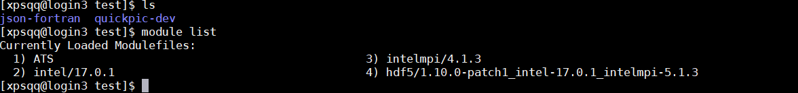
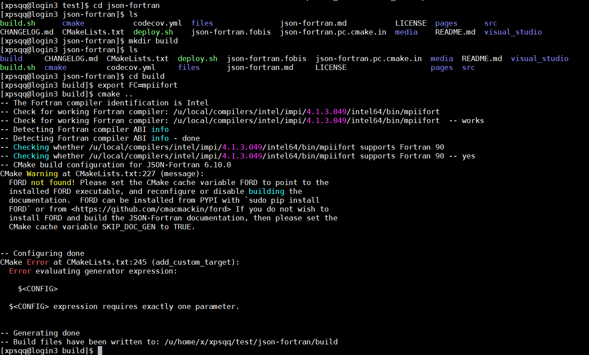
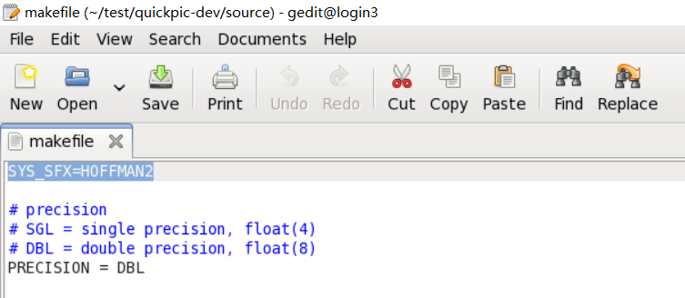
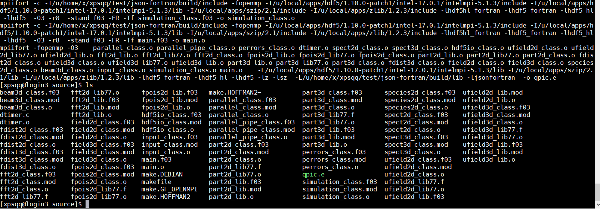

Build QuickPIC on Hoffman2
===

Environment
---
Load modules by `module load <modulename>`

~~~
intel/17.0.1
intelmpi/4.1.3
hdf5/1.10.0-patch1_intel-17.0.1_intelmpi-5.1.3
~~~

Use `module list` to check loaded modules. Here is my module list

Build json-fortran
---

Run the following command to build json-fortran（just an example, you can build the json-fortran any where）

~~~
git clone https://github.com/UCLA-Plasma-Simulation-Group/QuickPIC-OpenSource.git
cd json-fortran
mkdir build
cd build
export FC=mpiifort
cmake ..
make
~~~

After `make`, in the lib directory, delete three *.so file.

Build QuickPIC
---

~~~
git clone https://github.com/UCLA-Plasma-Simulation-Group/QuickPIC-OpenSource.git
~~~

In QuickPIC source directory, edit SYS_SFX in `makefile` as `SYS_SFX=HOFFMAN2`

Edit JSON_INC and JSON_LIB in make.HOFFMAN2 as the json build include and lib directory

Then `make`, you can see the `qpic.e`

